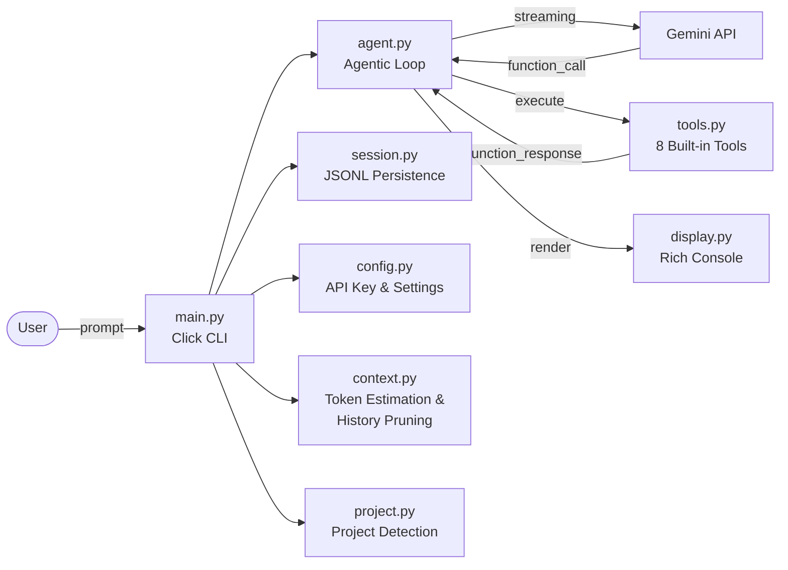

# minimal-cli

[](https://github.com/arman1o1/minimal-cli/actions/workflows/tests.yml)

A lightweight coding agent for the terminal, powered by Google Gemini function calling. It reads, writes, searches, and runs commands in your project — all through natural language.

## Overview

minimal-cli drops you into an interactive chat session (or runs a single prompt) where a Gemini model can use built-in tools to explore and modify your codebase. It auto-detects project type, persists sessions across runs, and manages context window limits transparently.

## Architecture



## Project Structure

```
minimal-cli/
  src/minimal_cli/
    main.py          # CLI entrypoint, slash commands, interactive loop
    agent.py         # Agentic loop with streaming and tool execution
    tools.py         # 8 sandboxed tools (read, write, grep, run, fetch, etc.)
    tool_schema.py   # Gemini function declarations
    config.py        # API key resolution and config file management
    session.py       # JSONL-based session persistence
    context.py       # Token estimation and history pruning
    project.py       # Auto-detection of project type and metadata
    display.py       # Rich-based console rendering and interactive selectors
  tests/             # pytest suite (52 tests)
  pyproject.toml     # Package metadata and dependencies
```

## Setup and Installation

Requires Python 3.10 or later.

```bash
# Clone the repository
git clone https://github.com/arman1o1/minimal-cli.git
cd minimal-cli

# Create a virtual environment and install
python -m venv .venv
.venv/Scripts/activate   # Windows
# source .venv/bin/activate  # Linux/macOS

# Install package in editable mode
pip install -e .
```

Or install directly from PyPI:

```bash
pip install minimal-cli
```

## Configuration

Set your Gemini API key using any of the following methods (listed by priority):

| Priority | Method | Example |
|----------|--------|---------|
| 1 | CLI flag | `minimal-cli --api-key "your-key"` |
| 2 | Environment variable | `export GEMINI_API_KEY="your-key"` |
| 3 | Config file | `~/.minimal-cli/config.json` |
| 4 | Interactive prompt | CLI prompts on first run and saves automatically |

Config file example (`~/.minimal-cli/config.json`):

```json
{
  "api_key": "your-gemini-api-key",
  "model": "gemini-3.1-flash-lite",
  "max_tool_calls": 25,
  "command_timeout": 60
}
```

## Running the Application

**Interactive mode:**

```bash
minimal-cli
```

**One-shot mode:**

```bash
minimal-cli "fix import errors in src/app.py"
```

**CLI options:**

| Flag | Description |
|------|-------------|
| `-m, --model TEXT` | Override model (default: `gemini-3.1-flash-lite`) |
| `--api-key TEXT` | Override API key for current run |
| `-v, --verbose` | Show detailed tool-call logs |
| `--version` | Show version |

**Slash commands in interactive mode:**

| Command | Description |
|---------|-------------|
| `/help` | Show available commands |
| `/model` | Switch model interactively or by name |
| `/clear` | Clear conversation history |
| `/add <path>` | Inject file contents into context |
| `/sessions` | List saved sessions |
| `/resume` | Resume a previous session |
| `/save <path>` | Export conversation to JSON |
| `/load <path>` | Import conversation from JSON |

## Built-in Tools

The agent has access to 8 sandboxed tools:

- **read_file** -- Read file contents with optional line range
- **write_file** -- Create or overwrite files
- **list_directory** -- List directory contents (respects `.gitignore`)
- **list_files_recursive** -- Recursive directory listing with depth control
- **run_command** -- Execute shell commands (requires user confirmation)
- **grep_search** -- Pattern search via ripgrep with Python fallback
- **replace_in_file** -- Find-and-replace with safety checks
- **fetch_url** -- Fetch URLs with SSRF protection and HTML-to-markdown conversion

## Testing

```bash
pip install pytest pytest-mock
pytest
```

All unit tests pass across agent, context, project detection, session management, and tool modules.

## License

MIT
